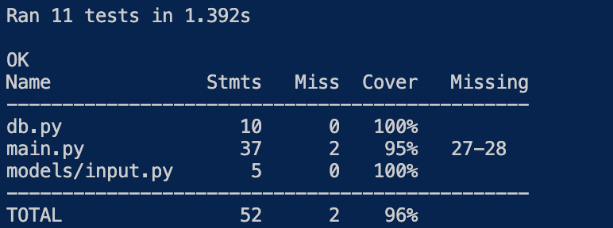
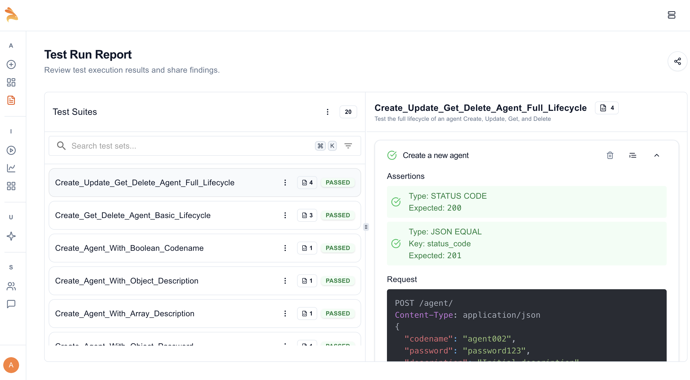

# Agent Management API

A FastAPI-based RESTful API for managing agent records, using MongoDB Atlas as the backend database. This API allows you to create, retrieve, update, and delete agent records securely.

## Database
- **Type:** MongoDB Atlas (cloud-hosted)
- **Integration:** The server connects to MongoDB Atlas using the `pymongo` library and the `certifi` package for SSL certificate verification. The connection is established in `db.py`:
  ```python
  from pymongo.mongo_client import MongoClient
  from pymongo.server_api import ServerApi
  import certifi
  uri = "<your-mongodb-uri>"
  client = MongoClient(uri, server_api=ServerApi('1'), tlsCAFile=certifi.where())
  db = client.agents_db
  collection = db['agents_data']
  ```

## API Endpoints

### 1. Get Agent by Codename and Password
- **Endpoint:** `/agent/{codename}/{password}`
- **Method:** GET
- **Description:** Retrieve agent details by codename and password.
- **Sample Request:**
  ```http
  GET /agent/jamesbond/secret123
  ```
- **Sample Response:**
  ```json
  {
    "_id": "60f7c2e2e1b1c8a1b8e4d123",
    "codename": "jamesbond",
    "password": "secret123",
    "description": "MI6 Agent"
  }
  ```

### 2. Create Agent
- **Endpoint:** `/agent/`
- **Method:** POST
- **Description:** Create a new agent. Codename must be unique.
- **Request Body:**
  ```json
  {
    "codename": "jamesbond",
    "password": "secret123",
    "description": "MI6 Agent"
  }
  ```
- **Sample Response:**
  ```json
  {
    "status_code": 201,
    "id": "60f7c2e2e1b1c8a1b8e4d123"
  }
  ```
- **Error (Duplicate):**
  ```json
  {
    "detail": "Agent with this codename already exists.",
    "status_code": 409
  }
  ```

### 3. Update Agent
- **Endpoint:** `/agent/`
- **Method:** PUT
- **Description:** Update an agent's details. Requires correct codename and password in the body.
- **Request Body:**
  ```json
  {
    "codename": "jamesbond",
    "password": "secret123",
    "description": "Updated MI6 Agent"
  }
  ```
- **Sample Response:**
  ```json
  {
    "status_code": 200,
    "detail": "Agent updated successfully."
  }
  ```
- **Error (Not Found):**
  ```json
  {
    "detail": "Agent not found or password incorrect.",
    "status_code": 404
  }
  ```

### 4. Delete Agent
- **Endpoint:** `/agent/{codename}/{password}`
- **Method:** DELETE
- **Description:** Delete an agent by codename and password.
- **Sample Request:**
  ```http
  DELETE /agent/jamesbond/secret123
  ```
- **Sample Response:**
  ```json
  {
    "status_code": 200,
    "detail": "Agent deleted successfully."
  }
  ```
- **Error (Not Found):**
  ```json
  {
    "detail": "Agent not found or password incorrect.",
    "status_code": 404
  }
  ```

## How to Run the Server

### Option 1: Use my Deployed APIs on Postman
- My Render Url - https://agentmanagementapis.onrender.com
- Use Postman to send requests directly to my Render URL.

### Option 2: Clone and Run Locally
1. **Clone the repository:**
   ```sh
   git clone https://github.com/AryanV-Coder/AgentManagementAPIs.git
   cd AgentManagementAPIs
   ```
2. **Install dependencies:**
   ```sh
   pip install -r requirements.txt
   ```
3. **Set up your MongoDB Atlas URI in `db.py`.**
4. **Run the server:**
   ```sh
   uvicorn main:app --reload
   ```
5. **Access the API:**
   - Use [Postman](https://www.postman.com/) to send requests to `http://localhost:8000` or Use FastAPI Swagger UI

## Interacting with the API
- Use Postman to test all endpoints.
- Set the request type (GET, POST, PUT, DELETE) and provide the required parameters or body as shown above.

---

## Testing & Coverage

### Testing Frameworks/Tools Used
- **unittest**: Python's built-in testing framework
- **unittest.mock**: For mocking database operations in unit tests
- **FastAPI TestClient**: For API endpoint testing
- **coverage.py**: For measuring code coverage

### Types of Tests
- **Unit Tests:**
  - Test the logic of each API endpoint in isolation.
  - Use mocking to simulate database operations (e.g., agent found/not found, conflict, etc.).
  - Example: Creating, updating, deleting, and retrieving agents with mocked DB responses.
- **Integration Tests:**
  - Test the interaction between the FastAPI server and the real MongoDB database.
  - Ensure CRUD operations work end-to-end.
  - Example: Actually inserting, updating, and deleting agents in the test database.
- **API Tests:**
  - Use FastAPI's TestClient to send HTTP requests to the API endpoints.
  - Validate correct status codes and responses for all endpoints.

### How to Run the Tests
1. **Run all tests and check coverage:**
   ```sh
   coverage run --source=main,db,models -m unittest tests.py
   coverage report -m
   ```
2. **(Optional) Generate an HTML coverage report:**
   ```sh
   coverage html
   open htmlcov/index.html
   ```

### Test Coverage Screenshot



> **Note:** The screenshot above shows the achieved coverage (96%).

---

## OpenAPI Schema & Documentation

This API includes comprehensive OpenAPI documentation accessible through:

- **Interactive API Docs (Swagger UI):** `/docs`
- **Alternative Docs (ReDoc):** `/redoc`
- **OpenAPI Schema (JSON):** `/openapi.json`

### Generate OpenAPI Schema
To generate the OpenAPI schema file locally:
```sh
python generate_openapi.py
```
This creates an `openapi.json` file that can be used with Keploy API testing or imported into other tools.

---

## API Testing with Keploy

This project integrates with [Keploy](https://keploy.io/) for AI-powered API testing:

### Keploy Test Reports



> **Note:** The screenshot above shows successful Keploy API test execution with detailed test results.

### Manual Testing with Curl Commands
Use the provided curl commands to test the API:
```sh
./api_test_commands.sh
```

---

## CI/CD Pipeline

This project includes a comprehensive CI/CD pipeline using **GitHub Actions** that:

1. **Runs Unit Tests:** Executes all unit, integration, and API tests
2. **Measures Coverage:** Generates coverage reports (96% achieved)
3. **Starts Services:** Spins up MongoDB and FastAPI server
4. **Generates OpenAPI Schema:** Creates schema for API testing
5. **Runs Keploy API Tests:** Executes AI-powered API tests
6. **Uploads Artifacts:** Saves test reports and coverage data

### Pipeline Configuration
See `.github/workflows/ci-cd.yml` for the complete pipeline configuration.

### Pipeline Status


---

Feel free to fork, clone, or deploy this project. For any issues, open an issue in the repository.
